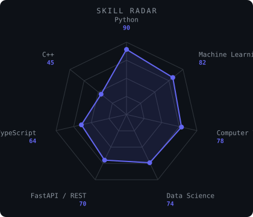
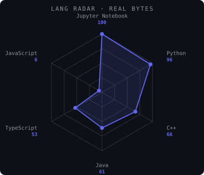
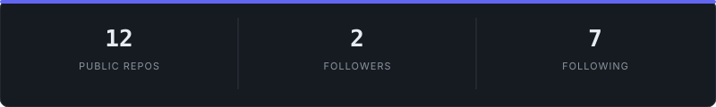
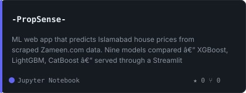
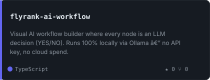
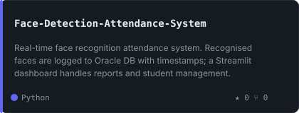
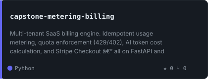

<div align="center">

<picture>
  
</picture>

<br />


<br /><br />

<a href="mailto:bassamraja123@gmail.com"></a>
<a href="https://github.com/Bassamkhalid011"></a>


</div>

---

## `~/` whoami

```console
$ cat about.txt
```

Hi, I'm **Bassam Khalid** — an AI student at COMSATS University, Islamabad. I build ML systems, vision pipelines, and APIs that do something real.

- Currently building **[PropSense](https://github.com/Bassamkhalid011/-PropSense-)** — predicts Islamabad property prices from scraped Zameen.com data, nine models compared
- Learning **multi-agent orchestration and LLM evaluation pipelines**
- Based in **Rawalpindi, Pakistan**
- Open to **AI/ML internships and research collaborations**

---

## `~/` toolbox


---

## `~/` radar

<table><tr>

<td width="50%" align="center">

<picture>
  <source media="(prefers-color-scheme: dark)" srcset="assets/radar-dark.svg">
  <source media="(prefers-color-scheme: light)" srcset="assets/radar-light.svg">
  
</picture>

</td>

<td width="50%" align="center">

<picture>
  <source media="(prefers-color-scheme: dark)" srcset="assets/radar-langs-dark.svg">
  <source media="(prefers-color-scheme: light)" srcset="assets/radar-langs-light.svg">
  
</picture>

</td>

</tr></table>

---

## `~/` activity

<picture>
  <source media="(prefers-color-scheme: dark)" srcset="assets/metrics.svg">
  <source media="(prefers-color-scheme: light)" srcset="assets/metrics.light.svg">
  
</picture>

<div align="center">

<picture>
  <source media="(prefers-color-scheme: dark)" srcset="https://raw.githubusercontent.com/Bassamkhalid011/Bassamkhalid011/output/snake-dark.svg">
  <source media="(prefers-color-scheme: light)" srcset="https://raw.githubusercontent.com/Bassamkhalid011/Bassamkhalid011/output/snake.svg">
  
</picture>

</div>

---

## `~/` stats

<picture>
  <source media="(prefers-color-scheme: dark)" srcset="assets/card-stats-dark.svg">
  <source media="(prefers-color-scheme: light)" srcset="assets/card-stats-light.svg">
  
</picture>

---

## `~/` projects

<table><tr>

<td width="50%">
<a href="https://github.com/Bassamkhalid011/-PropSense-">
<picture>
  <source media="(prefers-color-scheme: dark)" srcset="assets/card--PropSense--dark.svg">
  <source media="(prefers-color-scheme: light)" srcset="assets/card--PropSense--light.svg">
  
</picture>
</a>
</td>

<td width="50%">
<a href="https://github.com/Bassamkhalid011/flyrank-ai-workflow">
<picture>
  <source media="(prefers-color-scheme: dark)" srcset="assets/card-flyrank-ai-workflow-dark.svg">
  <source media="(prefers-color-scheme: light)" srcset="assets/card-flyrank-ai-workflow-light.svg">
  
</picture>
</a>
</td>

</tr><tr>

<td width="50%">
<a href="https://github.com/Bassamkhalid011/Face-Detection-Attendance-System">
<picture>
  <source media="(prefers-color-scheme: dark)" srcset="assets/card-Face-Detection-Attendance-System-dark.svg">
  <source media="(prefers-color-scheme: light)" srcset="assets/card-Face-Detection-Attendance-System-light.svg">
  
</picture>
</a>
</td>

<td width="50%">
<a href="https://github.com/Bassamkhalid011/capstone-metering-billing">
<picture>
  <source media="(prefers-color-scheme: dark)" srcset="assets/card-capstone-metering-billing-dark.svg">
  <source media="(prefers-color-scheme: light)" srcset="assets/card-capstone-metering-billing-light.svg">
  
</picture>
</a>
</td>

</tr></table>

<sub>

| project | stack | link |
|---|---|---|
| **PropSense** | Python · Streamlit · XGBoost · LightGBM · Selenium | [repo](https://github.com/Bassamkhalid011/-PropSense-) |
| **AI Workflow Builder** | Next.js 14 · React Flow · Inngest · Ollama · TypeScript | [repo](https://github.com/Bassamkhalid011/flyrank-ai-workflow) |
| **Face Attendance** | Python · OpenCV · face\_recognition · Streamlit · Oracle DB | [repo](https://github.com/Bassamkhalid011/Face-Detection-Attendance-System) |
| **Metering & Billing** | Python · FastAPI · PostgreSQL · Stripe | [repo](https://github.com/Bassamkhalid011/capstone-metering-billing) |

</sub>
